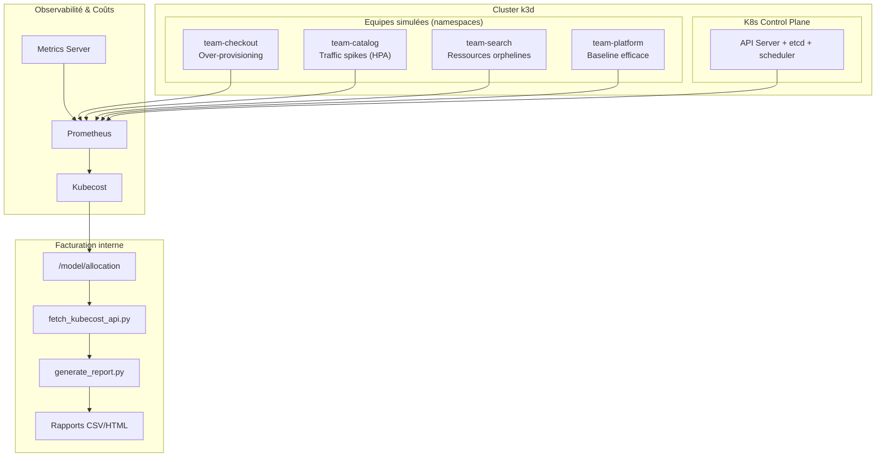

# Kubecost Multi-Tenant Cost Allocation Lab

[](https://opensource.org/licenses/MIT)
[](https://kubernetes.io)
[](https://kubecost.com)
[](https://conventionalcommits.org)

Un cluster Kubernetes partagé et simulé (k3d), avec des équipes fictives aux comportements de consommation volontairement différents, pour démontrer la valeur de **Kubecost** en matière d'**allocation de coûts**, de **chargeback** et de **détection de gaspillage**.

**Objectif** : répondre à la question *"qui coûte quoi, et pourquoi ?"* via des patterns de coût observables et reproductibles.

---

## Démarrage rapide

```bash
# 1. Provisionner le cluster k3d
./cluster/setup-cluster.sh

# 2. Installer Kubecost + pricing custom
./kubecost/install-kubecost.sh

# 3. Déployer les 4 équipes simulées
kubectl apply -f teams/

# 4. Lancer les simulations de comportement
./scripts/simulate_overprovisioning.sh
./scripts/simulate_traffic_spike.sh
./scripts/simulate_orphan_resources.sh

# 5. Générer les rapports de chargeback
python chargeback/fetch_kubecost_api.py
python chargeback/generate_report.py
```

---

## Vue d'ensemble



---

## Structure du projet

```
kubecost-multitenant-lab/
├── README.md                # This file (overview)
├── AGENTS.md                # Règles & conventions pour agents
├── .commitlintrc            # Validation Conventional Commits
├── cluster/                 # Provisioning k3d (config + scripts)
├── kubecost/                # Installation Helm + pricing custom
├── teams/                   # 4 équipes simulées (namespaces + workloads)
│   ├── team-checkout/
│   ├── team-catalog/
│   ├── team-search/
│   └── team-platform/
├── scripts/                 # Simulations de comportement + reset
├── chargeback/              # Extraction API + génération de rapports
└── docs/                    # Architecture, scénarios, FinOPS, roadmap
```

---

## Documentation

| Doc | Contenu |
|---|---|
| [docs/architecture.md](docs/architecture.md) | Architecture technique, data flow, modèle d'allocation |
| [docs/scenarios.md](docs/scenarios.md) | Les 4 équipes, scripts de simulation, résultats attendus |
| [docs/finops-practices.md](docs/finops-practices.md) | Bonnes pratiques FinOPS (showback → chargeback, rightsizing…) |
| [docs/roadmap.md](docs/roadmap.md) | Roadmap phase par phase pour compléter le projet |
| [docs/agents/](docs/agents/) | Skills, rules et workflows pour agents (voir AGENTS.md) |
| [AGENTS.md](AGENTS.md) | Point d'entrée agent : conventions et orientation |

---

## Le problème démontré en 1 image

Chaque équipe paie dans Kubecost ce qu'elle **réserve** (requests) vs ce qu'elle **utilise** :

| Équipe | Comportement | Signal Kubecost |
|---|---|---|
| `team-checkout` | Requests très hautes, usage minime | Écart coût alloué vs coût réel → rightsizing |
| `team-catalog` | Pics de trafic, HPA 1→10 replicas | Variation du coût dans le temps |
| `team-search` | PVC / LoadBalancer orphelins | Coûts cachés non nettoyés |
| `team-platform` | Requests = usage, charge stable | Baseline de référence (efficience 100 %) |

---

## Licence

MIT — voir [LICENSE](LICENSE).