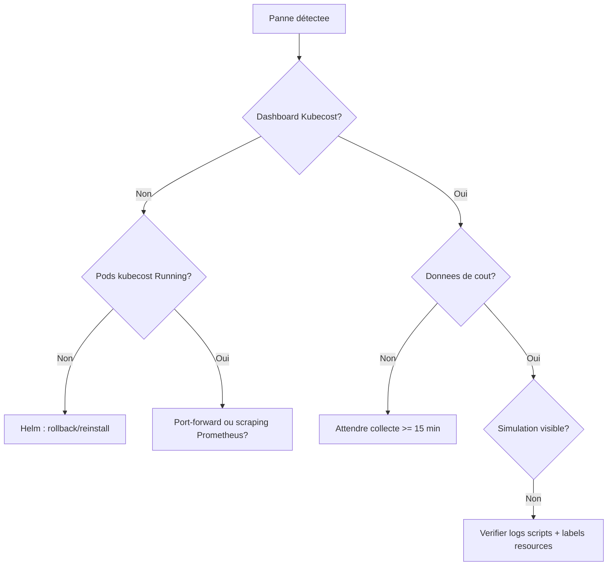

# Agent Workflows — Dev, démo, troubleshooting, maintenance

Procédures opérationnelles à suivre selon le contexte de travail.

## Workflow de développement

```
1. Feature/issue → branche dédiée depuis main
2. Implémentation → commits Conventional Commits
3. Validation → lint (yamllint, shellcheck, ruff) + tests/simulations
4. Documentation → mise à jour docs/ associées
5. Revue → PR avec description claire (scope, attendus kubecost)
6. Merge → déploiement sur l'environnement lab
```

### Vérifications avant merge
```bash
yamllint cluster/ kubecost/ teams/          # YAML valides
shellcheck cluster/*.sh scripts/*.sh        # Bash robuste
ruff check chargeback/                      # Python conforme
```

---

## Workflow de démo (10 min)

Un déroulé pilote pour une démo live sans accroc.

```bash
# 1. CAMÉRA — reset total
./scripts/reset_scenario.sh

# 2. Cluster sain
kubectl get nodes                              # tous Ready

# 3. Kubecost prêt
kubectl get pods -n kubecost                   # cost-analyzer Running
kubectl port-forward svc/kubecost-cost-analyzer -n kubecost 9090:9090 &

# 4. Déploiement des 4 équipes
kubectl apply -f teams/

# 5. Simulations (une par comportement, en expliquant)
./scripts/simulate_overprovisioning.sh         # team-checkout
./scripts/simulate_traffic_spike.sh            # team-catalog
./scripts/simulate_orphan_resources.sh         # team-search

# 6. Attendre la collecte (~15 min) puis montrer le dashboard

# 7. Chargeback
python chargeback/fetch_kubecost_api.py
python chargeback/generate_report.py --format html

# 8. Proposition de rightsizing sur team-checkout → rejouer pour l'économie
```

### Points de vigilance démo
- Vérifier 10 min avant que les pods de simulation soient tous `Running`.
- Ne pas oublier le log de l'heure de lancement (`scripts/logs/`) corrélé au dashboard.
- Avoir les screenshots de secours dans `docs/screenshots/`.

---

## Workflow de troubleshooting

Escalade logique en cas de problème.

| Étape | Action | Symptôme |
|---|---|---|
| 1 | `kubectl get nodes` | Cluster KO / node NotReady |
| 2 | `kubectl get pods -A` | Pods en CrashLoop / Pending |
| 3 | `kubectl top nodes` | Surcharge CPU/mémoire |
| 4 | `docker ps` / `k3d cluster list` | Cluster k3d absent ou stoppé |
| 5 | `kubectl get pods -n kubecost` | Kubecost non prêt |
| 6 | `curl localhost:9090/model/allocation?window=15m` | Pas de données de coût |
| 7 | `tail scripts/logs/*.log` | Simulation défaillante |
| 8 | `kubectl logs -n kubecost deploy/cost-analyzer` | Erreur Kubecost |

### Arbre de décision rapide


---

## Escalade

| Problème | Référent | Ressource utile |
|---|---|---|
| Cluster k3d | Admin infra | k3d.io, `k3d cluster logs` |
| Kubecost / allocation | SRE coûts | docs.kubecost.com, GitHub issues |
| Scripts / simulation | Owner teams | `scripts/logs/`, workflow démo |
| Chargeback / rapports | FinOPS | Boudget doc, docs/finops-practices.md |
| Sécurité | RSSI | Policy admission, scan images |

---

## Benchmarks (objectifs de perf)

| Métrique | Cible |
|---|---|
| Provisioning cluster k3d | < 2 min |
| Kubecost disponible | < 5 min |
| Données d'allocation exploitables | collecte ≥ 15 min |
| Génération rapport par équipe | < 30 s |
| Reset complet pour démo | < 3 min |
| Écart total alloué vs invoice | < 5 % |

---

## Maintenance

### Quotidien
- Vérifier les logs de simulation (`scripts/logs/`)
- Contrôler la collecte Kubecost
- Contrôler l'utilisation du cluster (`kubectl top nodes`)

### Hebdomadaire
- Générer et revoir les rapports de chargeback
- Mettre à jour la documentation
- Nettoyer ressources orphelines

### Mensuel
- Revoir le pricing custom (`cloud-pricing.yaml`)
- Évaluer la pertinence des scénarios simulés
- Mettre à jour les dépendances / images et scanner les vulnérabilités

---

## Intégrations

### API / endpoints
| Endpoint | Usage |
|---|---|
| `http://localhost:9090/model/allocation` | Coûts par namespace/label sur une fenêtre |
| `http://localhost:9090/model/assets` | Coûts par ressource (stockage, LB…) |
| `https://localhost:6443/apis/metrics.k8s.io/v1beta1` | Usage CPU/mémoire |
| `https://localhost:6443/api/v1` | Objets Kubernetes |

### Outils externes
- **k6** / **hey** : génération de charge `team-catalog`
- **Prometheus** : métriques consommées par Kubecost
- **Grafana** (bonus) : dashboards custom sur l'API Kubecost