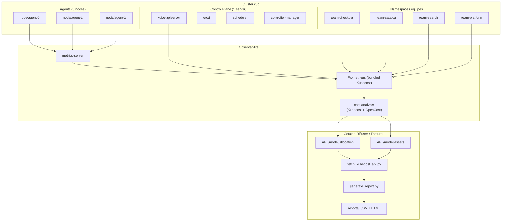
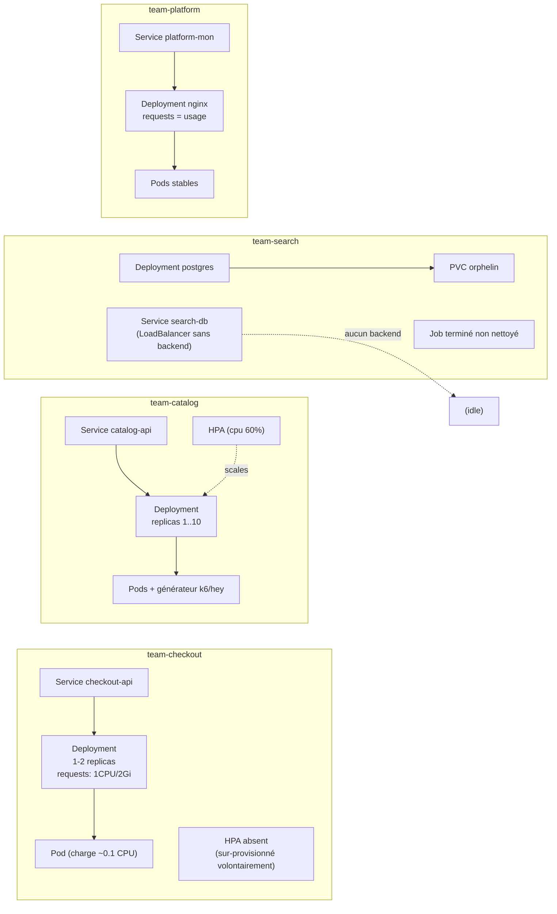
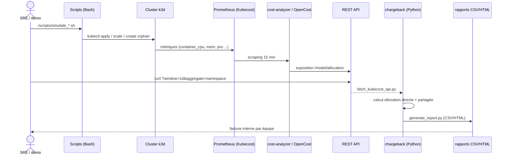
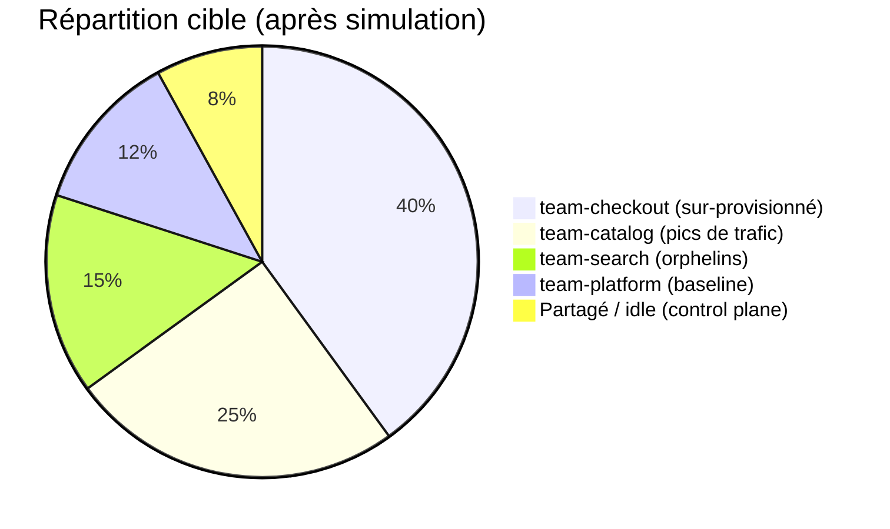

# Architecture technique

Architecture détaillée du **Kubecost Multi-Tenant Cost Allocation Lab**.

## Vue globale

## Déploiement logique des équipes

Chaque équipe est un namespace isolé (ResourceQuota + LimitRange) avec des workloads légers.

## Flux de données de coût

## Modèle d'allocation des coûts

### Règles d'allocation
1. **Direct** : CPU, mémoire, stockage, réseau par pod → namespace d'équipe.
2. **Partagé** : control plane, monitoring, ingress → réparti au prorata de la consommation.
3. **Idle** : capacité non utilisée → assignée au budget plateforme (explicite).
4. **Orphelin** : PVC / LB / Jobs détachés → identifiés, coût visible pour inciter au nettoyage.
5. **Reconcilication** : total alloué ≈ total cluster (< 5 % d'écart).

> Méthode conforme aux principes FinOps (allocation 100 %, pas de coût sans propriétaire).

## Stack technique

| Composant | Choix | Justification |
|---|---|---|
| Cluster | **k3d** (`--agents 3 --servers 1`) | Multi-node en quelques secondes, servicelb intégré, reset rapide |
| Monitoring de coûts | **Kubecost** (Helm, OpenCost engine) | Allocation + dashboard + API |
| Pricing | **Custom pricing config** | k3d n'a pas de billing cloud → tarif on-prem simulé |
| Génération de charge | **k6** / **hey** | Pics CPU réels pour scaling crédible |
| Scripts | **Bash** | Idempotents, logs horodatés |
| Chargeback | **Python** | PEP 8 + type hints, API Kubecost |

## Sécurité & critères d'exposition

- Dashboard uniquement via `kubectl port-forward`, jamais publié.
- RBAC minimal (service accounts par namespace).
- NetworkPolicy deny-all par défaut (si activé).
- Images scannées pour vulnérabilités.