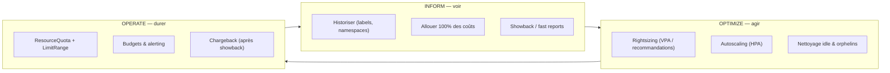

# Bonnes pratiques FinOPS appliquées

Référence des pratiques FinOPS (FinOps Foundation, CNCF/OpenCost, blogs SRE 2026) que ce laboratoire implémente et démontre.

## Le cycle FinOps : Inform → Optimize → Operate

Ce lab **incarne les trois phases** : Inform via Kubecost/OpenCost et les rapports, Optimize via les recommandations de rightsizing sur `team-checkout`, Operate via ResourceQuotas et le rapport de chargeback.

## Principes directeurs

### 1. Labeling contracté dès le départ
- Labels obligatoires : `team`, `product`, `env` (+ labels recommandés Kubecost/OpenCost).
- L'absence de labels = coût `__unallocated__` → **alerter si > 10 %** du total.
- Le labeling se fait **à l'admission** (admission policy) pour ne pas dégrader.

### 2. Allocation 100 %, aucun coût orphelin
- Répartition des coûts **partagés** (control plane, monitoring, ingress) : proportionnelle à la consommation.
- Coûts **idle** : assignés à un budget plateforme explicite.
- **Reconcilication** mensuelle du total alloué vs facture cluster (< 5 % d'écart).

### 3. Showback avant chargeback
- Commencer par du **showback** (informatif) : les équipes valident les chiffres ~90 jours.
- Migrer ensuite vers le **chargeback** (imputation budgétaire réelle) une fois les chiffres acceptés.
- Ce lab génère la « facture interne » (chargeback) comme démonstration.

### 4. Rightsizing fondé sur l'usage réel
- CPU : `requests` = 50-70 % de l'usage moyen.
- Mémoire : `requests` = ~90 % de l'usage moyen (OOM plus coûteux que throttling).
- Limits : CPU 2-3× requests, mémoire 1.2-1.5× requests.
- Outils : VPA en mode recommandation (`Off`) ou Goldilocks.

### 5. Quotas pour éviter la tragédie des communs
- `ResourceQuota` par namespace (plafond CPU/mémoire/compteurs d'objets).
- `LimitRange` pour imposer des defaults de `requests`/`limits` à l'admission.
- Blocage à la source plutôt que surveillance passive.

### 6. Alerting sur dérive budgétaire
| Alerte | Condition |
|---|---|
| Seuil quotidien | coût du jour > budget défini par namespace |
| Dérive hebdo | coût 7 jours > +30 % sans nouveau déploiement |
| Efficience | un namespace < 50 % d'efficience (moitié réservée idle) |
| Unallocated | `__unallocated__` > 10 % du total |

## Patterns d'allocation (extraits de la pratique 2026)

| Pattern | Usage dans le lab |
|---|---|
| **Par namespace** | Allocation principale (1 namespace = 1 équipe) |
| **Par label** | Regroupement cross-namespace / produit |
| **Partagés distribués** | Control plane + monitoring répartis au prorata |
| **Idle séparé** | Budget plateforme pour la capacité non utilisée |
| **Showback periodique** | Rapports hebdo/quotidiens par équipe |

## Métriques d'efficience à surveiller

- **Efficiency** = coût utilisé / coût alloué. `team-platform` ≈ 100 %, `team-checkout` ≪ 50 %.
- **Idle ratio** = capacité non utilisée / capacité totale.
- **Unallocated ratio** = coût sans propriétaire / total (< 10 %).

## Le lab comme démonstration des économies

1. `team-checkout` sur-provisionne → recommandation de rightsizing (~90 % d'économie potentielle sur requests CPU).
2. Rejouer le scénario après correction du manifest → l'écart coût alloué vs utilisé se résorbe.
3. Le rapport de chargeback montre la **baisse de la facture interne** de l'équipe.

## Sources

- FinOps Foundation — phases Inform/Optimize/Operate
- CNCF / OpenCost — allocation engine, label contract, unallocated alerting
- Guides SRE 2026 — rightsizing targets, quotas, budgets, autoscaling
- Kubecost docs — custom pricing, allocation settings, budgets & alerts