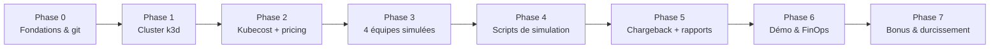

# Roadmap du projet

Phases à suivre pour compléter le **Kubecost Multi-Tenant Cost Allocation Lab**. Chaque phase produit des livrables concrets, validés par des critères de réussite. Le statut est mis à jour au fil du travail.

## Vue d'ensemble

## Phase 0 — Fondations & conventions

**Objectif** : dépôt propre, conventions appliquées, environnement de dev prêt.

- [x] README + AGENTS + guide agent (skills/rules/workflows)
- [x] Convention de commits (`.commitlintrc`)
- [ ] Hook pre-commit (commitlint + yamllint + shellcheck + ruff)
- [ ] Script `scripts/check_environment.sh` (k3d, kubectl, helm, python, jq présents)
- [ ] Fichiers `.gitignore`, `LICENSE` (MIT)
- [ ] Dépendances pins: versions k3d, helm chart Kubecost, images

**Critère de réussite** : un commit `feat(ci): add pre-commit hooks` passe l'ensemble des lints.

---

## Phase 1 — Cluster k3d

**Objectif** : cluster multi-node reproductible pour la démo.

- [ ] `cluster/k3d-config.yaml` — config déclarative :
  - 1 server, 3 agents
  - ports mappés (api-server, 9090 pour Kubecost)
  - volumes si besoin (persistance Prometheus)
- [ ] `cluster/setup-cluster.sh` — provisioning + validation `kubectl get nodes`, install metrics-server
- [ ] `cluster/teardown-cluster.sh` — suppression propre
- [ ] Test : création < 2 min, recréation à l'identique via config

**Critère de réussite** : `./cluster/setup-cluster.sh` produit 4 nodes Ready en < 2 min, deux fois de suite.

---

## Phase 2 — Kubecost + pricing custom

**Objectif** : monitoring de coûts opérationnel avec un tarif crédible pour k3d.

- [ ] `kubecost/install-kubecost.sh` — helm repo + install chart `cost-analyzer`
- [ ] `kubecost/values.yaml` — allocation par namespace/label/annotation, retention, `service.type: ClusterIP`
- [ ] `kubecost/cloud-pricing.yaml` — tarif custom on-prem :
  - vCPU/h, Gi RAM/h, Gi storage/h, coût réseau
- [ ] Vérification : dashboard via `port-forward 9090`, données d'allocation après ≥ 15 min
- [ ] Documentation du choix de pricing (pourquoi tel tarif → [finops-practices.md](finops-practices.md))

**Critère de réussite** : `curl localhost:9090/model/allocation?window=15m` retourne des données cohérentes avec la config pricing.

---

## Phase 3 — Les 4 équipes simulées

**Objectif** : 4 namespaces isolés avec profiles de consommation contrastés.

Pour chaque équipe (dossier `teams/team-*/`) :

- [ ] `namespace.yaml` — labels (team/product/env) + ResourceQuota + LimitRange
- [ ] `deployment.yaml` — workloads légers (`http-echo`, `nginx`, `postgres`) avec requests/limits documentés
- [ ] `behavior.md` — comportement simulé + signal Kubecost attendu
- [ ] ResourceQuota/LimitRange par namespace

### Profils attendus (détail dans [scenarios.md](scenarios.md))
- `team-checkout` : requests 1 CPU/2Gi, usage ~0.1 CPU (sur-provisionnement volontaire)
- `team-catalog` : requests raisonnables + `horizontalpodautoscaler.yaml` (1→10)
- `team-search` : deployment postgres + PVC `storageClass`, Service LoadBalancer, sans workload actif derrière
- `team-platform` : requests = usage réel, baseline

**Critère de réussite** : `kubectl apply -f teams/` déploie tout ; Kubecost affiche 4 namespaces avec labels corrects.

---

## Phase 4 — Scripts de simulation

**Objectif** : rendre chaque pattern de coût rejouable et corrélé à des logs.

- [ ] `scripts/common.sh` — helpers (logs horodatés, logging utils), `set -euo pipefail`
- [ ] `scripts/simulate_overprovisioning.sh` — applique team-checkout, journalise
- [ ] `scripts/simulate_traffic_spike.sh` — lance Job k6/hey + `kubectl scale` vs HPA, capture replicas
- [ ] `scripts/simulate_orphan_resources.sh` — PVC détaché, LB sans backend, Job terminé
- [ ] `scripts/simulate_idle_waste.sh` — pods au repos 24/7 avec requests élevées
- [ ] `scripts/reset_scenario.sh` — nettoyage complet des namespaces/ressources (idempotent)
- [ ] Logs horodatés écrits dans `scripts/logs/`

**Critère de réussite** : chaque script tourne deux fois (rejouable), produit un log horodaté, et son effet est visible dans Kubecost après ~15 min.

---

## Phase 5 — Chargeback & rapports

**Objectif** : transformer l'API Kubecost en « facture interne » par équipe.

- [ ] `chargeback/fetch_kubecost_api.py` — appel `/model/allocation` (fenêtre paramétrable, pagination)
- [ ] `chargeback/generate_report.py` — aggrégation par équipe :
  - coût total, ventilation CPU/mémoire/stockage/réseau
  - écart alloué vs utilisé
  - répartition des coûts partagés (proportional)
- [ ] Sorties CSV + HTML simple dans `chargeback/reports/`
- [ ] Vérification de la **reconcilication** : total alloué ≈ total cluster (< 5 %)
- [ ] (Nice) visualisation Mermaid/barchart dans le rapport HTML

**Critère de réussite** : rapport généré < 30 s, chiffres cohérents avec le dashboard, écart < 5 %.

---

## Phase 6 — Démo & validation FinOps

**Objectif** : scénario de démonstration de 10 min fiable et rejouable.

- [ ] `scripts/demo_full.sh` — enchaîne reset → deploy → simulations → rapport
- [ ] Script du pitch (étape par étape) documenté dans [workflows.md](agents/workflows.md)
- [ ] Screenshots du dashboard dans `docs/screenshots/` (avant/après)
- [ ] Script de droitsizing post-démo sur team-checkout montrant l'économie
- [ ] Benchmarks : reset < 3 min, rapport < 30 s

**Critère de réussite** : la démo complète se joue sans escalade technique et illustre les 4 patterns + le report de chargeback.

---

## Phase 7 — Bonus & durcissement (optionnel)

**Objectif** : étendre la valeur du lab.

- [ ] Dashboards Grafana custom branchés sur l'API Kubecost
- [ ] Alerting Kubecost sur dérive budgétaire par équipe
- [ ] NetworkPolicies deny-all par namespace
- [ ] Scan des images (trivy) dans un job CI
- [ ] VPA (mode `Off`) : recommandations visibles dans le dashboard
- [ ] CI GitHub Actions : lint + commitlint + validation YAML
- [ ] (challenge) Autoscaling du cluster (k3d + karpenter est hors scope, documenter pourquoi)

---

## État d'avancement global

- [x] Phase 0 (partiel) — conventions & docs
- [ ] Phase 1 — cluster k3d
- [ ] Phase 2 — Kubecost + pricing
- [ ] Phase 3 — 4 équipes simulées
- [ ] Phase 4 — scripts de simulation
- [ ] Phase 5 — chargeback & rapports
- [ ] Phase 6 — démo & validation
- [ ] Phase 7 — bonus

> Mise à jour : à cocher au fil de l'avancement, chaque livrable dans un commit `feat(scope): …`, validation automatisée via [workflows.md](agents/workflows.md).