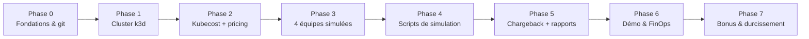

# Roadmap du projet

Phases à suivre pour compléter le **Kubecost Multi-Tenant Cost Allocation Lab**. Chaque phase produit des livrables concrets, validés par des critères de réussite. Le statut est mis à jour au fil du travail.

## Vue d'ensemble

```mermaid
flowchart LR
    P0["Phase 0<br/>Fondations & git"] --> P1["Phase 1<br/>Cluster k3d"]
    P1 --> P2["Phase 2<br/>Kubecost + pricing"]
    P2 --> P3["Phase 3<br/>4 équipes simulées"]
    P3 --> P4["Phase 4<br/>Scripts de simulation"]
    P4 --> P5["Phase 5<br/>Chargeback + rapports"]
    P5 --> P6["Phase 6<br/>Démo & FinOps"]
    P6 --> P7["Phase 7<br/>Bonus & durcissement"]
```

## Phase 0 — Fondations & conventions

**Objectif** : dépôt propre, conventions appliquées, environnement de dev prêt.

- [x] README + AGENTS + guide agent (skills/rules/workflows)
- [x] Convention de commits (`.commitlintrc`)
- [ ] Hook pre-commit (commitlint + yamllint + shellcheck + ruff)
- [ ] Script `scripts/check_environment.sh` (k3d, kubectl, helm, python, jq présents)
- [ ] Fichiers `.gitignore`, `LICENSE` (MIT)
- [ ] Dépendances pins: versions k3d, helm chart Kubecost, images

**Critère de réussite** : un commit `feat(ci): add pre-commit hooks` passe l'ensemble des lints.

---

## Phase 1 — Cluster k3d ✅

**Objectif** : cluster multi-node reproductible pour la démo.

- [x] `cluster/k3d-config.yaml` — config déclarative k3d v1alpha5 :
  - 1 server + 3 agents
  - API server sur port hôte 7443 (6443 occupé par le k3s système) — Kubecost non exposé (règle sécurité, port-forward uniquement)
  - traefik désactivé, `servicelb` conservé pour les LoadBalancer
- [x] `cluster/setup-cluster.sh` — provisioning idempotent + attente nodes Ready + boucle d'attente metrics-server (`kubectl top`)
- [x] `cluster/teardown-cluster.sh` — suppression propre
- [x] Test : création reproductible via config, 4 nodes Ready, `kubectl top nodes` OK

> Notes d'environnement : le démarrage k3s y est lent (pulls d'images) → `options.k3d.timeout: 600s` obligatoire, sinon k3d abort à tort.

**Critère de réussite** : `./cluster/setup-cluster.sh` produit 4 nodes Ready, deux fois de suite (vérifié ✅).

---

## Phase 2 — Kubecost + pricing custom ✅

**Objectif** : monitoring de coûts opérationnel avec un tarif crédible pour k3d.

- [x] `kubecost/install-kubecost.sh` — helm repo + install chart `cost-analyzer` (idempotent)
- [x] `kubecost/values.yaml` — config allégée : mapping labels (`team`/`product`/`env`), `service.type: ClusterIP`, Grafana/forecasting/PVC désactivés
- [x] `kubecost/cloud-pricing.yaml` — `kubecostProductConfigs.defaultModelPricing` (prix mensuels, base 730 h) :
  - CPU `$30`/vCPU-mois, RAM `$4`/GiB-mois, storage `$0.10`/GiB-mois, réseau egress `$0`
- [x] Vérification : pods Ready, API up, pricing custom appliqué, scraping Prometheus OK
- [x] Documentation du choix de pricing (voir [kubecost/README.md](../kubecost/README.md) + [finops-practices.md](finops-practices.md))

> **Version du chart** : 2.9.x est un chart de migration 3.0 qui exige un object-store
> (`global federated-store`) → on utilise **2.8.7**, dernière 2.x autonome.
>
> **Note KSM** : le cost-model émet lui-même les métriques de type kube-state-metrics
> (`kube_pod_labels`, `container_cpu_allocation`, `node_cpu_hourly_cost`) → pas besoin
> de déployer `kube-state-metrics` séparément.

**Critère de réussite** : `curl localhost:9090/model/allocation?window=15m` retourne des données cohérentes avec la config pricing.

Vérifié ✅ : `node_cpu_hourly_cost=0.041096` (= 30/730) et `node_ram_hourly_cost=0.005479`
(= 4/730) sur les 4 nodes ; `kube_pod_labels` présent (11 séries) ; `provider: custom`.
L'allocation par `label:team` sera peuplée en Phase 3.

---

## Phase 3 — Les 4 équipes simulées ✅

**Objectif** : 4 namespaces isolés avec profiles de consommation contrastés.

Pour chaque équipe (dossier `teams/team-*/`) :

- [x] `namespace.yaml` — labels (team/product/env) + ResourceQuota + LimitRange
- [x] `deployment.yaml` — workloads légers (`http-echo`, `nginx`, `postgres`) avec requests/limits documentés
- [x] `behavior.md` — comportement simulé + signal Kubecost attendu
- [x] ResourceQuota/LimitRange par namespace

### Profils attendus (détail dans [scenarios.md](scenarios.md))
- `team-checkout` : requests 1 CPU/2Gi, usage ~0.1 CPU (sur-provisionnement volontaire) — `hashicorp/http-echo`
- `team-catalog` : requests raisonnables + `horizontalpodautoscaler.yaml` (1→10, cible 60 % CPU) — `nginx`
- `team-search` : deployment postgres + PVC `local-path` 5Gi (non monté) + Service LoadBalancer port 8081 — orphelins
- `team-platform` : requests = usage réel, baseline — `nginx`

> **Environnement** : le `my-wordpress` du namespace `default` (hors lab) bind
> déjà le host port 80 sur les 4 nodes via klipper-lb → le LB orphelin de
> `team-search` utilise le **port 8081** pour pouvoir allouer ses IP.

**Critère de réussite** : `kubectl apply -f teams/` déploie tout ; Kubecost affiche 4 namespaces avec labels corrects.

Vérifié ✅ : 4 pods Running (checkout, catalog, search-db, platform), HPA actif
(`cpu: 1%/60%`), LB orphelin avec 4 IP externes, et `label_team`/`label_product`/
`label_env` bien scrapés par Prometheus pour les 4 équipes. L'allocation par
`label:team` se peuple après le warm-up ETL (~25 min) de Kubecost.
Apply en deux passes (`kubectl apply -R -f teams/`), cf. [teams/README.md](../teams/README.md).

---

## Phase 4 — Scripts de simulation ✅

**Objectif** : rendre chaque pattern de coût rejouable et corrélé à des logs.

- [x] `scripts/common.sh` — helpers (logs horodatés, `set -euo pipefail`, pré-requis)
- [x] `scripts/simulate_overprovisioning.sh` — applique team-checkout, journalise usage
- [x] `scripts/simulate_traffic_spike.sh` — Job `hey` + HPA, capture replicas/CPU (défauts réglés pour un scaling visible)
- [x] `scripts/simulate_orphan_resources.sh` — PVC détaché (bind puis abandon), LB sans backend, Job terminé non nettoyé
- [x] `scripts/simulate_idle_waste.sh` — pods au repos 24/7 avec requests élevées
- [x] `scripts/reset_scenario.sh` — nettoyage complet des namespaces (idempotent)
- [x] Logs horodatés écrits dans `scripts/logs/`

**Critère de réussite** : chaque script tourne deux fois (rejouable), produit un log horodaté, et son effet est visible dans Kubecost après ~15 min.

Testé ✅ : chaque simulateur + `reset_scenario.sh` exécutés (rejouables), spike observé
**1 → 4 → 8 replicas** avec `hey` (nginx plafonné à ses limits 200m — voir
[scripts/README.md](../scripts/README.md) pour régler `SPIKE_RATE` jusqu'à 10).
Logs dans `scripts/logs/`.

---

## Phase 5 — Chargeback & rapports ✅

**Objectif** : transformer l'API Kubecost en « facture interne » par équipe.

- [x] `chargeback/fetch_kubecost_api.py` — interroge `/model/allocation` (fenêtre/agrégat, `shareIdle`)
- [x] `chargeback/generate_report.py` — ventilation CPU/mémoire/stockage/réseau/LB par équipe
- [x] Écart coût **alloué** (requests) vs **utilisé** (usage réel) via les efficacités
- [x] Coûts `__idle__` / `__unallocated__` exposés + variante `--share-idle` (répartition au prorata)
- [x] Sorties CSV + HTML (barres CSS, recommandations rightsizing/nettoyage) dans `chargeback/reports/`
- [x] Réconciliation : total alloué ≈ total cluster — mesuré **0,00 %**
- [x] (Nice) visualisation native (CSS) dans le HTML

**Critère de réussite** : rapport généré < 30 s, chiffres cohérents avec le dashboard, écart < 5 %.
✅ Testé (`--window 1d` et `--share-idle`) : réconciliation 0,00 %, ~quelques secondes, logs dans `chargeback/reports/`.

---

## Phase 6 — Démo & validation FinOps 🚧

**Objectif** : scénario de démonstration de 10 min fiable et rejouable.

- [x] `scripts/demo_full.sh` — enchaîne reset → deploy → simulations → rapport
- [x] `scripts/deploy_teams.sh` — déploiement idempotent des 4 équipes (2 passes)
- [x] Script du pitch (étape par étape) documenté dans [workflows.md](agents/workflows.md)
- [x] Script de droitsizing post-démo sur team-checkout (`scripts/rightsize_demo.sh`, ≈ -34 $/mois/réplica)
- [ ] Screenshots du dashboard dans `docs/screenshots/` (avant/après) — capture navigateur manuelle
- [x] Benchmarks : reset < 3 min, rapport < 30 s (mesurés)

**Critère de réussite** : la démo complète se joue sans escalade technique et illustre les 4 patterns + le report de chargeback.

> Réalisé : `demo_full.sh` exécuté de bout en bout (reset + deploy + 3 simulations + rapport,
> réconciliation 0,00 %). Reste la capture des screenshots (nécessite un navigateur).

---

## Phase 7 — Bonus & durcissement (optionnel) 🚧

**Objectif** : étendre la valeur du lab.

- [x] Dashboards Grafana branchés sur le Prometheus de Kubecost (`kubecost/grafana/`)
- [x] Alerting Kubecost sur dérive budgétaire par équipe (exemple `values-alerts.yaml.example`, non appliqué)
- [x] NetworkPolicies deny-all par namespace (exceptions Kubecost/DNS/intra-ns, appliquées et testées)
- [x] Scan des images (trivy) dans un job CI (`.github/workflows/ci.yml`)
- [x] CI GitHub Actions : commitlint + yamllint + bash + py_compile + trivy
- [ ] VPA (mode `Off`) : recommandations visibles dans le dashboard (non retenu)
- [ ] (challenge) Autoscaling du cluster (k3d + karpenter est hors scope, documenter pourquoi)

> Réalisé : CI, NetworkPolicies, Grafana (datasource + dashboard provisionnés),
> alerting documenté. Restent VPA et l'autoscaling de nœuds (hors périmètre retenu).

---

## État d'avancement global

- [x] Phase 0 (partiel) — conventions & docs
- [x] Phase 1 — cluster k3d
- [x] Phase 2 — Kubecost + pricing
- [x] Phase 3 — 4 équipes simulées
- [x] Phase 4 — scripts de simulation
- [x] Phase 5 — chargeback & rapports
- [ ] Phase 6 — démo & validation
- [ ] Phase 7 — bonus

> Mise à jour : à cocher au fil de l'avancement, chaque livrable dans un commit `feat(scope): …`, validation automatisée via [workflows.md](agents/workflows.md).