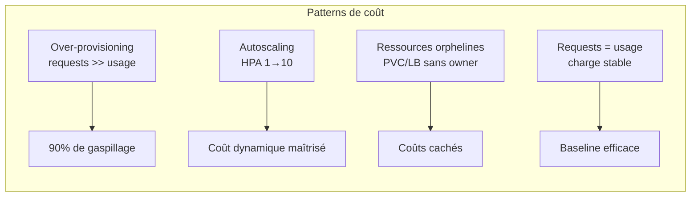

# Scénarios simulés et résultats attendus

Les 4 équipes fictives partagent le même cluster mais adoptent des comportements de consommation volontairement opposés afin de rendre chaque pattern de coût **visible** dans le dashboard Kubecost.

## Vue d'ensemble

| Équipe | Namespace | Workload | Image | Comportement | Signal Kubecost attendu |
|---|---|---|---|---|---|
| **Checkout** | `team-checkout` | API REST simple (Deployment + Service) | `hashicorp/http-echo` | Requests fixes très hautes (1 CPU / 2Gi) pour charge réelle minime | Écart coût **alloué vs utilisé** → n°1 rightsizing |
| **Catalog** | `team-catalog` | API + génération de charge (Job k6/hey) | `nginx` / `httpbin` | Pics de trafic scriptés → HPA 1→10 replicas | Variation du coût dans le temps, impact financier de l'autoscaling |
| **Search** | `team-search` | Base factice + PVC + Service LoadBalancer | `postgres` (petite instance non utilisée) | PVC détaché, LoadBalancer sans backend, Jobs terminés non nettoyés | Coûts « cachés » que personne ne surveille |
| **Platform** | `team-platform` | Stack monitoring légère | `nginx` bien dimensionné | Requests = usage, charge stable | **Baseline** de référence (efficience ~100 %) |



## Scénario 1 — Over-provisioning (team-checkout)

### Objectif
Montrer le gaspillage créé par des `requests` très supérieures à l'usage réel.

### Manifest (profil)
```yaml
# teams/team-checkout/deployment.yaml
# over-provisioning intent: requests 1CPU/2Gi pour une charge réelle ~0.1CPU/256Mi
resources:
  requests:
    cpu: "1"
    memory: "2Gi"
  limits:
    cpu: "1"
    memory: "2Gi"
```

### Script
```bash
./scripts/simulate_overprovisioning.sh
```

### Résultat attendu dans Kubecost
- Coût **alloué** (basé sur requests) net supérieur au coût **utilisé** (basé sur usage réel).
- Recommandation **rightsizing** : proposer ~0.1 CPU / 256 Mi.
- Efficiency score < 20 %.

## Scénario 2 — Traffic spike (team-catalog)

### Objectif
Montrer le coût d'un pic de trafic maîtrisé par l'autoscaling, puis le retour au calme.

### Setup
- `deployment.yaml` avec `limits` réalistes + HPA ciblant 60 % d'utilisation CPU.
- Générateur de charge : Job `k6` / `hey` lançant un volume important pendant une fenêtre définie.

### Script
```bash
./scripts/simulate_traffic_spike.sh
```

### Résultat attendu dans Kubecost
- Cost allocation qui croît pendant le pic puis revient à la baseline.
- Replicas observés : 1 → 10 → 1 (log à l'appui).
- Efficience élevée pendant le spike (ressources utilisées plutôt qu'idle).

## Scénario 3 — Ressources orphelines (team-search)

### Objectif
Montrer des coûts « invisibles » : ressources provisionnées dont personne ne nettoie.

### Création d'orphelins
1. **PVC détaché** : volume créé puis deployment supprimé (PVC conservé).
2. **LoadBalancer sans backend** : Service de type LoadBalancer pointant vers un `selector` vide.
3. **Job terminé non nettoyé** : Job `Completed` jamais supprimé.

### Script
```bash
./scripts/simulate_orphan_resources.sh
```

### Résultat attendu dans Kubecost
- Coûts **Storage** (PVC) et **Network** (LB) attribués à `team-search` sans workload actif associé.
- Défaut : ces ressources n'apparaissent pas dans le « cost by namespace » classique → à remonter via `/model/assets`.

## Scénario 4 — Idle waste (scripts)

### Objectif
Montrer le coût de resources réservées 24/7 sans charge.

```bash
./scripts/simulate_idle_waste.sh
```

### Résultat attendu
- Pods en état stable avec utilisation CPU quasi nulle mais requests élevées.
- Graphique flat-lining : coût constant sans bénéfice.

## Reset / rejouabilité

```bash
./scripts/reset_scenario.sh
```

Nettoie : namespaces teams, PVC, LoadBalancers, Jobs, HPA. Rejoue un scénario en moins de 3 minutes pour démo live.

## Méthodologie démo (pitch 10 min)

1. **Avant** : dashboard « propre », coûts homogènes.
2. **Lancer** les simulations une par une en expliquant le comportement injecté.
3. **Observer** : `team-checkout` explose en coût alloué vs utilisé, `team-search` révèle des orphelins, `team-catalog` montre pic → retour nominal.
4. **Générer** le rapport de chargeback → facture interne actionnable.
5. **Proposer** le rightsizing sur `team-checkout` et **rejouer** pour montrer l'économie réalisée.

## Critères de succès

| Critère | Seuil |
|---|---|
| Données d'allocation disponibles | collecte ≥ 15 min |
| Écart total alloué vs cluster | < 5 % |
| Rapport chargeback par équipe | temps < 30 s |
| Reset rejouable | < 3 min |
| 4 patterns distincts observables | visibles dans le dashboard |